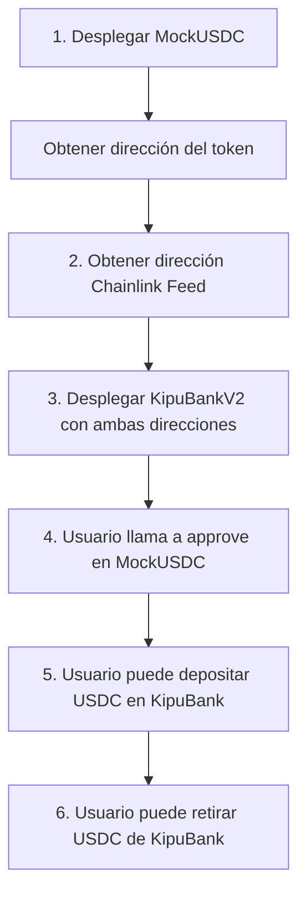

# KipuBank - Smart Contract Bancario

**Autor:** maugust
**Contacto:** https://github.com/maugust17
**Propósito:** TP2 y TP3 de ETHKipu - Proyecto educacional

## ⚠️ IMPORTANTE: No usar en producción

---

## 📖 Descripción

KipuBank es una serie de smart contracts bancarios desarrollados en Solidity que evolucionan desde un sistema simple de gestión de Ether (V1) hasta un banco descentralizado multi-token con integración de oráculos (V2).

---

## 🏦 KipuBank V1 (KipuBank.sol)

### Descripción
Smart contract bancario simple que permite a los usuarios crear cuentas, depositar y retirar Ether de forma segura. El contrato incluye protecciones contra ataques de reentrancy y límites de transacción.

### Funcionalidades Principales

#### 🏦 Gestión de Cuentas
- **Crear cuenta:** Los usuarios pueden registrarse con nombre y email
- **Balance personal:** Consulta del saldo individual de cada cuenta
- **Verificación de existencia:** Solo cuentas registradas pueden operar

#### 💰 Operaciones Financieras
- **Depósitos:** Agregar Ether a la cuenta propia
- **Retiros:** Extraer Ether de la cuenta (con límites de seguridad)
- **Balance del banco:** Solo el propietario puede ver el saldo total

#### 🔒 Características de Seguridad
- **Protección contra reentrancy:** Previene ataques de reentrada
- **Límite de retiro:** Máximo configurable por transacción
- **Capacidad del banco:** Límite total configurable en el contrato
- **Control de propietario:** Funciones administrativas restringidas

### Cómo Interactuar con el Contrato

#### 1. Despliegue
```solidity
// En Remix IDE, compilar y desplegar con parámetros:
constructor(uint256 _bankCap, uint256 _maxWithdrawAmount)
// Ejemplo: _bankCap = 10 ETH, _maxWithdrawAmount = 0.1 ETH
```

#### 2. Crear una Cuenta
```solidity
// Llamar función con ETH opcional para depósito inicial
createAccount("tu@email.com", "Tu Nombre")
```

#### 3. Depositar ETH
```solidity
// Enviar ETH junto con la llamada
depositIntoMyAccount()
```

#### 4. Consultar Balance
```solidity
// Solo el dueño de la cuenta puede ver su balance
getAccountBalance()
```

#### 5. Retirar ETH
```solidity
// Especificar cantidad en Wei (ejemplo: 0.1 ETH = 100000000000000000 Wei)
withdraw(100000000000000000)
```

#### 6. Funciones de Propietario
```solidity
// Solo el propietario del contrato puede llamar:
getTotalBankBalance()
```

### Límites y Restricciones

| Límite | Valor |
|--------|-------|
| Retiro máximo por transacción | Configurable (ej: 0.1 ETH) |
| Capacidad total del banco | Configurable (ej: 10 ETH) |
| Cuentas por dirección | 1 cuenta única |

### Eventos

El contrato emite los siguientes eventos:

- `KipuBank_Deposit(address origin, uint256 valor)`: Cuando se realiza un depósito
- `KipuBank_Withdraw(address destination, uint256 valor)`: Cuando se realiza un retiro

### Errores Personalizados

- `KipuBank_DifferentOwner()`: Acceso denegado a funciones de propietario
- `KipuBank_TransferError()`: Error en transferencia de ETH
- `KipuBank_AccountAlreadyExists()`: Cuenta ya existe para esta dirección
- `KipuBank_AccountNotExists()`: Cuenta no existe
- `KipuBank_InsufficientFunds()`: Saldo insuficiente
- `KipuBank_ExceedWithdrawAmount()`: Excede límite de retiro
- `KipuBank_ExceedBankCap()`: Excede capacidad del banco
- `KipuBank_NoReentrancy()`: Intento de ataque de reentrancy

### Estadísticas

El contrato mantiene contadores públicos de:

- `s_depositCounter`: Número total de depósitos realizados
- `s_withdrawCounter`: Número total de retiros realizados

---

## 🚀 KipuBank V2 (KipuBankV2.sol)

### Descripción
Evolución del contrato bancario con soporte multi-token (ETH + USDC), integración con Chainlink para conversión de precios, y uso de librerías de OpenZeppelin para mayor seguridad.

### 🆕 Nuevas Funcionalidades y Mejoras

#### 1. **Soporte Multi-Token**
- ✅ Gestión simultánea de **ETH nativo** y **tokens ERC20 (USDC)**
- ✅ Mapeo anidado: cada usuario puede tener balance en múltiples tokens
- ✅ Funciones específicas por token: `depositEther()`, `depositUSDC()`, `withdrawEther()`, `withdrawUSDC()`

#### 2. **Integración con Chainlink**
- ✅ Price Feed ETH/USD para conversión de precios en tiempo real
- ✅ Validación de frescura de datos (heartbeat de 1 hora)
- ✅ Protección contra oráculos comprometidos
- ✅ Función `contractBalanceInUSD()`: consulta el balance total del contrato en USD

#### 3. **Mejoras de Seguridad con OpenZeppelin**
- ✅ **Ownable:** Gestión de propietario mediante contrato auditado
- ✅ **SafeERC20:** Transferencias seguras de tokens ERC20
- ✅ Protección contra retornos de `transfer` que no reviertan

#### 4. **Arquitectura Mejorada**
- ✅ Mapeo anidado: `mapping(address user => mapping(address token => Account))`
- ✅ `address(0)` representa ETH nativo
- ✅ Otras direcciones representan tokens ERC20
- ✅ Modificadores específicos por token para validaciones

#### 5. **Nuevas Funciones**

##### Conversión de Precios
```solidity
// Consultar balance total del contrato en USD
function contractBalanceInUSD() public view returns (uint256 balance_)

// Conversión interna de ETH a USD usando Chainlink
function convertEthInUSD(uint256 _ethAmount) internal view returns (uint256)

// Consultar precio ETH/USD desde Chainlink
function chainlinkFeed() internal view returns (uint256 ethUSDPrice_)
```

##### Gestión por Token
```solidity
// Consultar balances específicos
function getAccountBalanceEther() public view returns (uint256)
function getAccountBalanceUSDC() public view returns (uint256)

// Depósitos específicos
function depositEther() external payable
function depositUSDC(uint256 _usdcAmount) external

// Retiros específicos
function withdrawEther(uint256 _amount) external
function withdrawUSDC(uint256 _amount) external
```

#### 6. **Nuevos Errores**
- `KipuBank_OracleCompromised()`: El oráculo retorna datos inválidos
- `KipuBank_StalePrice()`: Los datos del oráculo están desactualizados

#### 7. **Nuevos Eventos**
- `KipuBank_ChainlinkFeedUpdated(address feed)`: Se actualiza la dirección del Price Feed

### 📊 Comparación V1 vs V2

| Característica | V1 | V2 |
|----------------|----|----|
| **Tokens soportados** | Solo ETH | ETH + USDC (extensible) |
| **Oráculos** | ❌ | ✅ Chainlink Price Feeds |
| **Gestión de propietario** | Manual | OpenZeppelin Ownable |
| **Transferencias ERC20** | N/A | SafeERC20 |
| **Balance en USD** | ❌ | ✅ `contractBalanceInUSD()` |
| **Arquitectura de storage** | Mapeo simple | Mapeo anidado multi-token |
| **Funciones por token** | N/A | Separadas (Ether/USDC) |
| **Validación de precios** | N/A | Heartbeat + validaciones |

---

## 📦 Despliegue de KipuBank V2

### Requisitos Previos

Para desplegar KipuBankV2, necesitas:

1. **Un contrato ERC20** para USDC (o token compatible)
2. **Dirección del Price Feed de Chainlink** para ETH/USD
3. **Parámetros de configuración** del banco

### 🔧 Paso 1: Desplegar el Token ERC20

Primero, debes desplegar un contrato de token ERC20 que actuará como USDC en tu banco.

#### Opción A: Usar un Token ERC20 Existente

Si estás en una testnet (ej: Sepolia), puedes usar la dirección de USDC de prueba:

```
Sepolia USDC: 0x... (consultar direcciones oficiales)
```

#### Opción B: Desplegar tu Propio Token ERC20

Si necesitas desplegar tu propio token (por ejemplo, en una red local o para pruebas), puedes usar este contrato simple:

```solidity
// SPDX-License-Identifier: MIT
pragma solidity ^0.8.30;

import "@openzeppelin/contracts/token/ERC20/ERC20.sol";

contract MockUSDC is ERC20 {
    constructor() ERC20("Mock USDC", "mUSDC") {
        // Mintear 1,000,000 USDC (con 6 decimales como USDC real)
        _mint(msg.sender, 1000000 * 10**6);
    }

    function decimals() public pure override returns (uint8) {
        return 6; // USDC usa 6 decimales
    }
}
```

**Pasos para desplegar:**
1. Compilar el contrato `MockUSDC.sol` en Remix
2. Desplegarlo sin parámetros
3. **Guardar la dirección del contrato desplegado** (esta será tu `_usdc`)

**Ejemplo de dirección desplegada:**
```
MockUSDC desplegado en: 0x1234567890123456789012345678901234567890
```

### 🔧 Paso 2: Obtener la Dirección del Price Feed de Chainlink

Dependiendo de tu red, necesitas la dirección del agregador ETH/USD:

| Red | Dirección Price Feed ETH/USD |
|-----|------------------------------|
| **Ethereum Mainnet** | `0x5f4eC3Df9cbd43714FE2740f5E3616155c5b8419` |
| **Sepolia Testnet** | `0x694AA1769357215DE4FAC081bf1f309aDC325306` |
| **Polygon Mumbai** | `0x0715A7794a1dc8e42615F059dD6e406A6594651A` |

Consulta las direcciones actualizadas en: https://docs.chain.link/data-feeds/price-feeds/addresses

### 🔧 Paso 3: Desplegar KipuBankV2

Con el token ERC20 y el Price Feed listos, despliega KipuBankV2:

```solidity
constructor(
    uint256 _bankCap,           // Capacidad máxima por usuario (en unidades base)
    uint256 _maxWithdrawAmount, // Retiro máximo por transacción (en unidades base)
    address _feed,              // Dirección del Price Feed de Chainlink
    address _usdc               // Dirección del token ERC20 (USDC)
)
```

**Ejemplo de despliegue:**
```javascript
// Parámetros de ejemplo:
_bankCap = 10000000000000000000000      // 10,000 tokens (con 18 decimales)
_maxWithdrawAmount = 1000000000000000000 // 1 token (con 18 decimales)
_feed = 0x694AA1769357215DE4FAC081bf1f309aDC325306  // Chainlink ETH/USD Sepolia
_usdc = 0x1234567890123456789012345678901234567890  // Tu MockUSDC desplegado
```

**Ejemplo en Remix:**

1. Ir a la pestaña **"Deploy & Run Transactions"**
2. Seleccionar el contrato `KipuBank` (de KipuBankV2.sol)
3. Ingresar los parámetros en el campo de despliegue:
   ```
   10000000000000000000000,1000000000000000000,0x694AA1769357215DE4FAC081bf1f309aDC325306,0x1234567890123456789012345678901234567890
   ```
4. Click en **"Deploy"**
5. **Guardar la dirección del contrato KipuBank desplegado**

### 🔧 Paso 4: Aprobar el Contrato para Gastar USDC

**⚠️ PASO CRÍTICO:** Antes de poder depositar USDC en el banco, cada usuario debe **aprobar** al contrato KipuBank para que pueda transferir sus tokens.

#### ¿Por qué es necesario `approve()`?

Los tokens ERC20 tienen un mecanismo de seguridad donde:
1. El token pertenece al usuario (tu wallet)
2. Para que un contrato (KipuBank) pueda mover tus tokens, **tú debes darle permiso explícito**
3. Este permiso se otorga mediante la función `approve(spender, amount)`

#### Cómo hacer el `approve()`

##### Método 1: Desde Remix (Interfaz del Token ERC20)

1. En Remix, ve a la pestaña **"Deployed Contracts"**
2. Localiza tu contrato **MockUSDC** (o el token ERC20 que desplegaste)
3. Expande el contrato para ver sus funciones
4. Busca la función **`approve`**
5. Ingresa los parámetros:
   ```
   spender: 0xABCDEF...  // Dirección del contrato KipuBank
   amount: 1000000000    // Cantidad que permites gastar (ej: 1000 USDC con 6 decimales)
   ```
6. Click en **"transact"**
7. Confirma la transacción en tu wallet

##### Método 2: Desde Web3/Ethers.js

```javascript
// Usando ethers.js
const tokenAddress = "0x1234..."; // Dirección del MockUSDC
const bankAddress = "0xABCD...";  // Dirección de KipuBankV2
const amount = ethers.utils.parseUnits("1000", 6); // 1000 USDC (6 decimales)

const token = new ethers.Contract(tokenAddress, ERC20_ABI, signer);
await token.approve(bankAddress, amount);
```

##### Método 3: Aprobar Cantidad Ilimitada (Para pruebas)

```solidity
// Aprobar el máximo posible (equivalente a "aprobación infinita")
approve(kipuBankAddress, 2**256 - 1)
```

**⚠️ Nota:** En producción, **nunca** apruebes cantidades ilimitadas. Siempre aprueba solo lo que vas a depositar.

### 🔧 Paso 5: Interactuar con KipuBankV2

Una vez desplegado y con el `approve()` realizado, puedes:

#### 1. Crear una Cuenta
```solidity
createAccount("usuario@email.com", "Nombre Usuario")
```

#### 2. Depositar ETH
```solidity
depositEther() // Enviar ETH en el campo "Value"
```

#### 3. Depositar USDC
```solidity
// Primero asegúrate de haber hecho approve()
depositUSDC(1000000) // 1 USDC (si tiene 6 decimales)
```

#### 4. Consultar Balances
```solidity
getAccountBalanceEther()  // Balance de ETH
getAccountBalanceUSDC()   // Balance de USDC
contractBalanceInUSD()    // Balance total del contrato en USD
```

#### 5. Retirar Fondos
```solidity
withdrawEther(100000000000000000)  // 0.1 ETH
withdrawUSDC(500000)               // 0.5 USDC (si tiene 6 decimales)
```

### 📝 Resumen del Flujo de Despliegue



### 🎯 Ejemplo Completo Paso a Paso

```solidity
// PASO 1: Desplegar MockUSDC
// Resultado: 0x1111111111111111111111111111111111111111

// PASO 2: Desplegar KipuBankV2
constructor(
    10000 * 10**18,     // _bankCap: 10,000 tokens
    1000 * 10**18,      // _maxWithdrawAmount: 1,000 tokens
    0x694AA1769357215DE4FAC081bf1f309aDC325306,  // _feed: Chainlink Sepolia
    0x1111111111111111111111111111111111111111   // _usdc: MockUSDC desplegado
)
// Resultado: KipuBank desplegado en 0x2222222222222222222222222222222222222222

// PASO 3: Aprobar KipuBank desde MockUSDC
// Desde el contrato MockUSDC, llamar:
approve(
    0x2222222222222222222222222222222222222222,  // spender: KipuBank
    1000000 * 10**6                              // amount: 1,000,000 USDC
)

// PASO 4: Crear cuenta en KipuBank
createAccount("test@email.com", "Test User")

// PASO 5: Depositar USDC
depositUSDC(100 * 10**6)  // Depositar 100 USDC

// PASO 6: Verificar balance
getAccountBalanceUSDC()  // Retorna: 100000000 (100 USDC con 6 decimales)
```

---

## 🛠️ Desarrollo

### Entorno

- **IDE:** Remix (remix.ethereum.org)
- **Solidity:** ^0.8.30
- **Licencia:** MIT
- **Dependencias:**
  - OpenZeppelin Contracts (para V2)
  - Chainlink Contracts (para V2)

### Estructura del Proyecto

```
KipuBankV2/
├── KipuBank.sol           # Contrato V1 (solo ETH)
├── KipuBankV2.sol         # Contrato V2 (multi-token + Chainlink)
├── MockUSDC.sol           # Token ERC20 de prueba (opcional)
├── readme.md              # Esta documentación
└── artifacts/             # Artefactos compilados (generados por Remix)
```

### Comandos Útiles en Remix

- **Compilar:** `Ctrl+S` o botón "Compile"
- **Desplegar:** Pestaña "Deploy & Run Transactions"
- **Interactuar:** Usar la interfaz generada después del despliegue
- **Debug:** Usar el debugger integrado de Remix

---

## 📈 Flujo de Uso Típico

### Para V1 (KipuBank.sol)
1. Desplegar el contrato especificando la capacidad máxima y el límite de retiro
2. Crear cuenta personal con `createAccount()`
3. Depositar ETH usando `depositIntoMyAccount()` con value
4. Verificar balance con `getAccountBalance()`
5. Retirar ETH usando `withdraw()` (respetando límites)
6. Monitorear eventos para confirmar transacciones

### Para V2 (KipuBankV2.sol)
1. Desplegar MockUSDC (o usar USDC existente)
2. Desplegar KipuBankV2 con las direcciones de Chainlink Feed y USDC
3. Aprobar KipuBankV2 para gastar tus tokens USDC
4. Crear cuenta con `createAccount()`
5. Depositar ETH con `depositEther()` y/o USDC con `depositUSDC()`
6. Consultar balances individuales o balance total en USD
7. Retirar fondos usando `withdrawEther()` o `withdrawUSDC()`
8. Monitorear eventos y validar con Chainlink

---

## ⛽ Consideraciones de Gas

### V1
- **Creación de cuenta:** ~100,000 gas
- **Depósito:** ~50,000 gas
- **Retiro:** ~60,000 gas
- **Consultas:** ~30,000 gas

### V2
- **Creación de cuenta:** ~150,000 gas (crea 2 cuentas por token)
- **Depósito ETH:** ~55,000 gas
- **Depósito USDC:** ~70,000 gas (incluye transferencia ERC20)
- **Retiro ETH:** ~65,000 gas
- **Retiro USDC:** ~75,000 gas (incluye transferencia ERC20)
- **Consulta de precio Chainlink:** ~40,000 gas
- **Consultas de balance:** ~35,000 gas

---

## 🔐 Consideraciones de Seguridad

### Implementadas

✅ **Protección contra reentrancy** (patrón de cerrojo)
✅ **Checks-Effects-Interactions** en retiros
✅ **SafeERC20** para transferencias de tokens
✅ **Validación de oráculos** (Chainlink heartbeat)
✅ **Límites de retiro** configurables
✅ **Capacidad máxima** por usuario
✅ **Control de acceso** con OpenZeppelin Ownable

### Recomendaciones Adicionales para Producción

⚠️ **Auditoría de seguridad completa**
⚠️ **Tests exhaustivos** (unit, integration, fuzz)
⚠️ **Pausa de emergencia** (pausable pattern)
⚠️ **Timelock** para cambios administrativos
⚠️ **Límite de rate** para operaciones
⚠️ **Multisig** para funciones de owner
⚠️ **Validaciones adicionales** en Chainlink (roundId, answeredInRound)

---

## 📚 Referencias

- [OpenZeppelin Contracts](https://docs.openzeppelin.com/contracts/)
- [Chainlink Price Feeds](https://docs.chain.link/data-feeds/price-feeds)
- [Solidity Documentation](https://docs.soliditylang.org/)
- [Remix IDE](https://remix.ethereum.org/)
- [ERC20 Token Standard](https://eips.ethereum.org/EIPS/eip-20)

---

## 📄 Licencia

MIT License - Este proyecto es de código abierto y está disponible bajo la licencia MIT.

---

## ⚠️ Disclaimer Final

**Este contrato está diseñado únicamente con fines educativos como parte del programa ETHKipu.**

**No utilizar con fondos reales en producción sin:**
- Auditoría de seguridad profesional completa
- Testing exhaustivo en múltiples escenarios
- Revisión de las mejores prácticas actualizadas
- Implementación de controles adicionales de seguridad
- Consideración de vectores de ataque conocidos

**El autor no se hace responsable por pérdidas financieras derivadas del uso de este código.**

---

**Desarrollado con 💙 para la comunidad ETHKipu**
